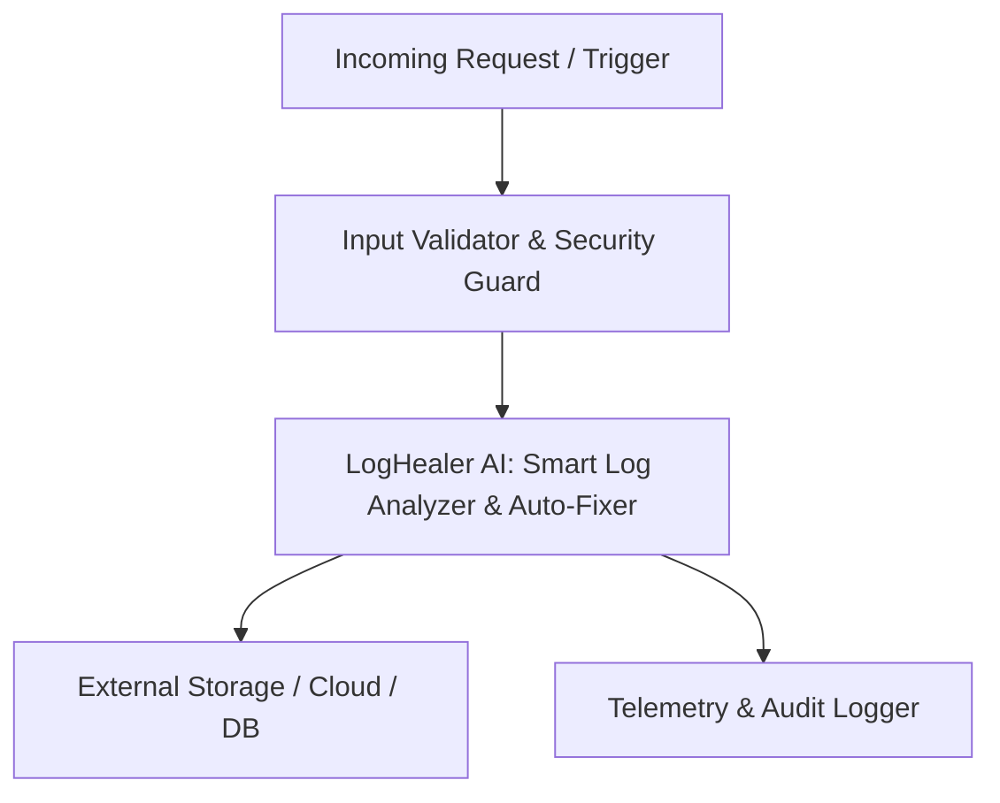

# LogHealer AI: Smart Log Analyzer & Auto-Fixer

[](LICENSE)
[](https://github.com/smit-backend/laravel-log-healer/stargazers)
[](https://github.com/smit-backend/laravel-log-healer/issues)
[](https://php.net)

> **AI-powered log listener that analyzes production error traces, isolates root causes, and suggests contextual code fixes.**

---

## 🚀 Key Highlights & Features

- **Production-Grade Architecture:** Designed specifically with decoupled, testable interfaces.
- **Enterprise Resiliency:** Built-in safeguards, structured exception handling, and observability.
- **Zero-Friction Setup:** Configurable via sensible defaults or deep environment customization.
- **Strictly Typed:** Complete type declarations compatible with PHP 8.2+ and modern standards.

---

## 🛠️ Architecture & Flow



---

## 📦 Installation & Setup

### Requirements
- **PHP:** `^8.2`
- **Composer:** Modern Composer v2+

### Installation via Composer
```bash
composer require smit-backend/laravel-log-healer
```

---

## ⚙️ Configuration & Quick Start

Publish configuration and default assets:
```bash
php artisan vendor:publish --tag="laravel-log-healer-config"
```

Sample configuration excerpt (`config/laravel-log-healer.php`):
```php
return [
    'enabled' => env('LARAVEL_LOG_HEALER_ENABLED', true),
    'log_channel' => env('LARAVEL_LOG_HEALER_LOG', 'stack'),
];
```

---

## 🧪 Testing

Run test suites locally:
```bash
composer test
```

---

## 🛡️ Security & Contributing

If you discover any security-related issues, please open an issue or email directly via GitHub. Contributions via pull requests are always welcome!

---

## 📄 License

This package is open-sourced software licensed under the [MIT License](LICENSE).

Developed and maintained with ❤️ by **[smit-backend](https://github.com/smit-backend)**.
